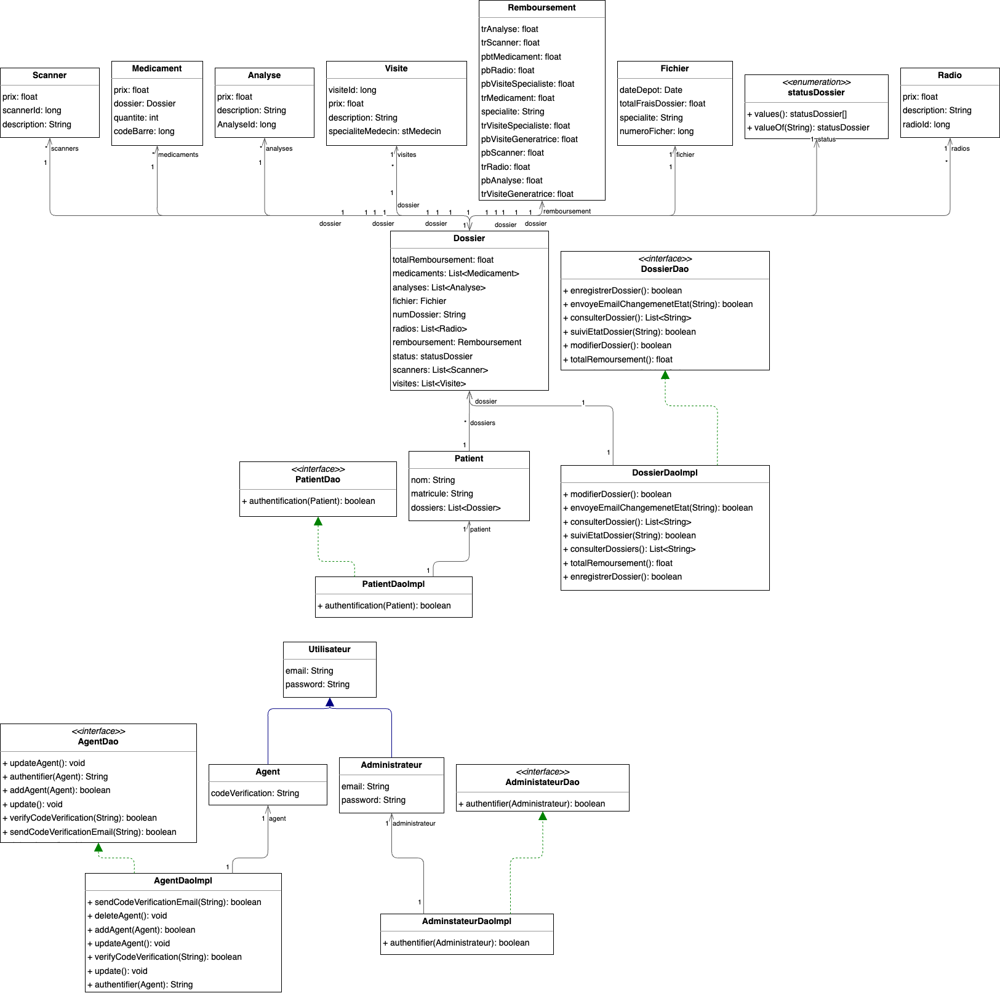

# **** Application Console MaCNSS ****

## **Class Diagram**

Dans le cadre de faciliter le suivi des dossiers des patients au Maroc, le groupe CNSS a lancé un appel d'offre pour la création d'une application console qui va être exploitée dans tous le réseau des agences CNSS Maroc. L’application **MaCNSS** va permettre aux agents CNSS de suivre en toute simplicité les dossiers de remboursement de chaque patient qui sont inscrit à la CNSS.

- **Chaque Agent CNSS** a un compte dans l'application, pour qu'il puisse accéder à l'application, il doit saisir l'email + mot de passe avec un code vérification envoyé sur son boite email valable (5min)

- **Quand le patient arrive à l'agence**, il dépose son dossier de remboursement, qui est constitué `obligatoirement` d'un formulaire CNSS, ce dossier est identifié par le matricule du patient, par la suite chaque patient `peut` joindre le code barre (si nécessaire) de chaque médicament prescrit sur l'ordonnance
- **Le patient** `peut` joindre aussi les analyses de laboratoire
- **Le patient** `peut` joindre une copie des radios ou scanner
- L’agent CNSS va vérifier manuellement chaque document et par la suite il saisit toutes les informations sur l'application MACNSS,
- le système va indiquer automatiquement à l'agent le montant de remboursement de chaque document déposé par le patient.
- Chaque document déposé par le patient est identifié par un code
- On a un seul administrateur dans le système qui va gérer les comptes des agents CNSS
- Chaque médicament a un taux de remboursement fixé par la direction de la cnss
- Il y a des médicaments qui ne sont pas remboursable par la CNSS, dans ce cas le patient `peut` avoir juste le remboursement d’une visite médicale
- À tout moment le patient `peut` consulter l’historique de ses dossiers de remboursement
- Le dossier du remboursement est soit : en attente, refusé ou validé

  **o En attente** : le dossier est en traitement par l’agent CNSS

  **o Refusé :** le dossier du patient est incomplet, un email est envoyé automatiquement au patient concerné avec le motif de refus

  **o Validé :** c’est un dossier terminé et traité par l’agent CNSS, dans ce sens un email est envoyé automatiquement au patient avec le montant du remboursement